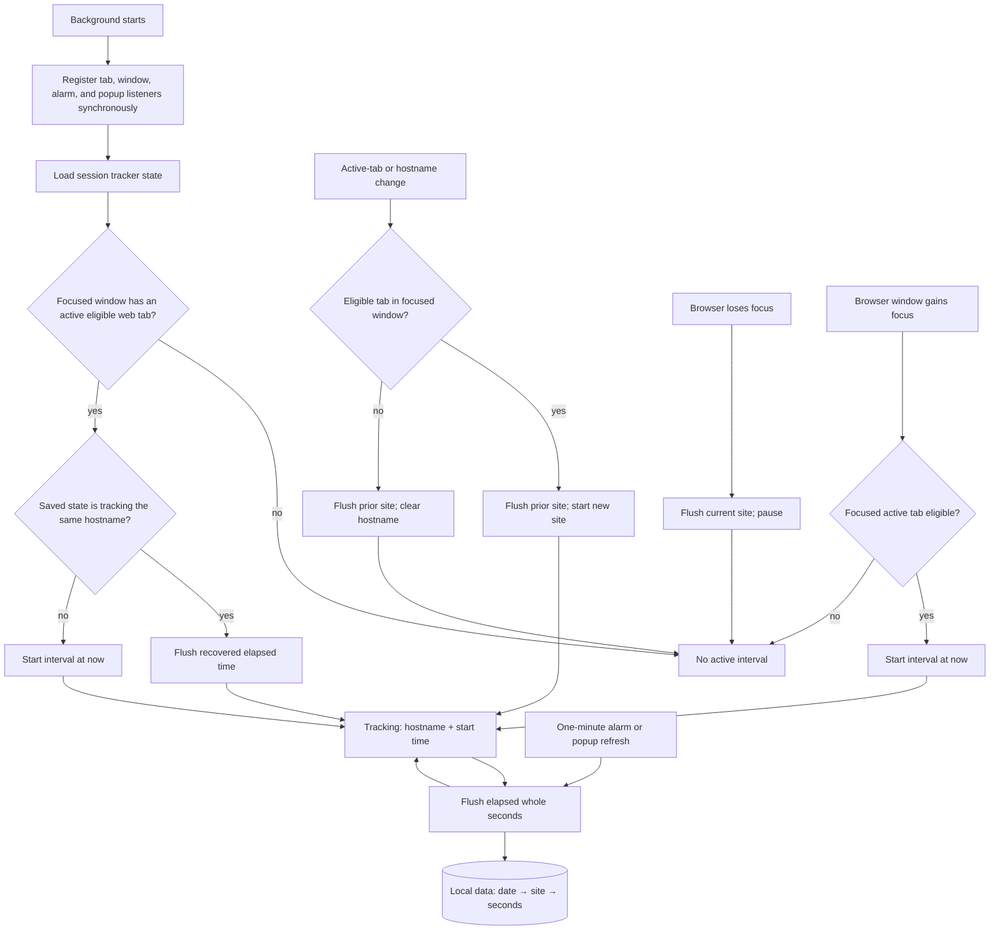

# PageTime specification

## Problem Statement

People need a simple, trustworthy way to understand how much time they spend on websites without creating an account, syncing data, or sending browsing information to another service. PageTime must show useful totals while counting only time that represents actual foreground browsing.

## Solution

PageTime is a Chrome and Firefox browser extension that records foreground time for non-incognito HTTP(S) tabs. It stores daily seconds per normalized site entirely in browser-local storage, presents concise dashboard totals, supports a CSV download, and allows a user to reset their own stored data.

## User Stories

1. As a browser user, I want PageTime to record time only for the tab I am actively viewing, so that background tabs do not inflate my totals.
2. As a browser user, I want tracking to stop when my browser window loses focus, so that time away from the browser is excluded.
3. As a browser user, I want passive reading and video playback to count, so that time on a focused site is not lost merely because I stop interacting.
4. As a browser user, I want tracking to resume when I return to a focused browser window, so that genuine foreground time continues to accumulate.
5. As a privacy-conscious user, I want all browsing data to stay in my browser, so that no account, sync service, or external data transfer is involved.
6. As a user, I want internal browser pages and extension pages ignored, so that only websites appear in my statistics.
7. As a user, I want incognito browsing ignored, so that private browsing remains untracked.
8. As a user, I want time grouped by calendar date, so that I can see today and recent-week usage accurately.
9. As a user, I want `www.youtube.com` and `youtube.com` grouped as one site, so that aliases do not split a site's time.
10. As a user, I want other subdomains to remain distinct, so that the dashboard does not make broader assumptions about site ownership.
11. As a user, I want the current active interval included when I open or refresh the popup, so that the displayed totals are current.
12. As a user, I want service-worker restarts to preserve attributable active time, so that browser lifecycle events do not silently undercount it.
13. As a user, I want uncertain time after an unobserved site change not assigned to the wrong site, so that accuracy is preferred over guessing.
14. As a user, I want to see my total for today, the trailing seven calendar days, or all stored time, so that I can choose a useful perspective.
15. As a user, I want the most-used sites ranked by time, so that I can quickly understand where my time went.
16. As a user, I want less-prominent sites grouped into an Others row, so that the popup stays compact.
17. As a user, I want time displayed in human-readable seconds, minutes, and hours, so that totals are immediately understandable.
18. As a user, I want to download my locally stored data as CSV, so that I can inspect or use it elsewhere.
19. As a user, I want CSV site rows to use the same `www.` normalization as the dashboard, so that the export agrees with what I see.
20. As a user, I want to reset all PageTime data after confirmation, so that I stay in control of my local history.
21. As a user, I want clear empty and error states in the popup, so that I know whether data is unavailable or simply has not been collected yet.
22. As a Chrome user, I want a Manifest V3 build, so that I can load the extension in Chrome.
23. As a Firefox user, I want a compatible Firefox build, so that I can load the extension temporarily for local use.

## Implementation Decisions

- The extension has a background tracking engine and a Svelte popup dashboard.
- Browsing data is local-only and uses a calendar-date-to-site-to-seconds mapping. It is intentionally not stored in sync storage and is never sent over the network.
- Tracker state is session-only: active Site, interval start time, and whether tracking is active. It is separate from persistent Browsing data.
- A Site is an HTTP(S) hostname with one leading `www.` removed. No public-suffix or broader registrable-domain grouping is applied; other subdomains remain distinct.
- Foreground time requires an active, non-incognito tab in a focused browser window. Passive time on that tab counts; browser-window focus loss pauses tracking.
- Tab activation, navigations, window focus changes, and periodic alarms drive interval flushing.
- Chrome registers those event listeners synchronously when its Manifest V3 service worker starts; asynchronous state restoration happens within the handlers so startup events are not missed.
- On background initialization, a saved interval is flushed only when its saved Site equals the current active Site. A mismatch starts a new interval to avoid assigning unknown elapsed time to the wrong Site.
- The popup requests a flush before reading Browsing data. It aggregates date records for Today, a rolling seven-day window, or all time; it displays the five largest Sites plus an Others aggregate when needed.
- CSV exports the complete stored date history with stable date and site ordering, escaped cells, and normalized Site grouping.
- Reset removes persistent Browsing data after user confirmation while keeping the tracker ready to continue the currently valid interval.
- Chrome uses a Manifest V3 service worker; Firefox uses its compatible background-script configuration. Both builds share the same tracking and popup behavior.

## Current Tracking Model

### Tracking flow

### What counts

PageTime counts wall-clock time for one **Site** when all of these are true:

1. The tab is active in its window.
2. That browser window is focused.
3. The tab is not incognito.
4. Its URL is HTTP or HTTPS.

The Site is the URL hostname with one leading `www.` removed. Paths, query strings, and fragments do not create separate records. Other subdomains remain separate. Time continues to count without keyboard or mouse activity, so passive reading and video playback count.

### Tracker states

| State | Stored hostname | Start time | Meaning |
| --- | --- | --- | --- |
| Tracking | Eligible hostname | Timestamp | Time accrues for that hostname. |
| No eligible Site | `null` | `null` | The focused tab is internal, an extension page, incognito, or otherwise not HTTP(S); nothing accrues. |
| Paused/not initialized | `null` | `null` | Nothing accrues. Browser-focus loss causes this state; startup on a noneligible page currently does too. |

The session-only tracker state is saved after every transition. The durable browsing data is a separate local-storage map of date, Site, and whole seconds.

### Start, stop, and flush events

| Event | Result |
| --- | --- |
| Background startup | Finds the focused window's active tab. If it matches a saved tracked Site, credits elapsed time; otherwise starts a new interval only when the tab is eligible. |
| Active-tab change | Flushes the old Site, then starts the eligible new Site. An internal or extension page leaves the tracker without a hostname. |
| URL hostname change in the active focused tab | Flushes the old Site, then starts the new eligible Site. A same-host navigation changes nothing. |
| Browser loses window focus | Flushes the current Site and pauses. |
| Browser window gains focus | Starts a new interval for that window's active eligible tab. |
| One-minute alarm | Flushes the active interval and immediately continues it. |
| Popup refresh | Flushes the active interval before the popup reads data. |
| Reset | Deletes browsing data and restarts the current eligible interval from zero. |

Chrome registers these listeners before asynchronous state loading, so a Manifest V3 service-worker wake-up event is not lost. Event work is serialized so rapid tab and window changes cannot update state out of order.

### Current accuracy boundaries

- This is foreground-tab tracking, not attention tracking. A focused tab counts while its page is visible behind a browser UI surface such as a docked DevTools panel.
- The clock is measured when the interval is flushed, rather than continuously. A crash or browser termination before the next event/alarm can lose up to roughly one minute of the current interval.
- Seconds are stored as whole numbers. Each flush drops its sub-second remainder.
- `addSeconds` assigns an entire flushed interval to the calendar date at flush time. An interval spanning local midnight is therefore not split between dates.
- Browser restart clears session tracker state, so closed-browser time never counts. A service-worker restart retains it only when the saved hostname still matches the active focused tab.
- Current defect: if startup finds no eligible Site, it stores a paused state. A later navigation from that page to an eligible Site records the hostname but does not start its clock until a browser-window focus change. That first visit is undercounted.

## Testing Decisions

- Tests verify observable behavior rather than private implementation detail: accumulated seconds, normalized dashboard/export data, filtering, formatting, and URL eligibility.
- The existing utility seam covers date keys, filtering, aggregation, CSV generation, time formatting, and hostname extraction/normalization.
- The public tracker initialization seam is tested with browser-storage and active-tab doubles. It proves that a matching saved active interval is credited after a service-worker restart and would fail under the prior undercounting behavior.
- Build and type-check remain release gates for both browser targets. Manual smoke testing should load each generated extension, browse a web page, switch tabs/windows and away from the browser, refresh the popup, export CSV, and reset data.

## Out of Scope

- Syncing, accounts, cloud storage, analytics, telemetry, or any transfer of browsing data outside the browser.
- Tracking incognito tabs, browser-internal pages, extension pages, file URLs, or non-HTTP(S) URLs.
- Cross-device reporting, server-side dashboards, notifications, budgets, blocking, or productivity coaching.
- Grouping arbitrary subdomains or full registrable domains beyond removing one leading `www.`.
- Guessing an attribution when a site change was not observed while the background worker was dormant.
- Richer dashboard visualizations beyond the existing compact totals and ranked list.

## Further Notes

The domain vocabulary is defined in the project's glossary: Browsing data, Foreground time, Site, and Tracker state. The foreground-time and hostname-normalization decisions are recorded in ADR 0001. Existing behavior uses browser-local persistent storage for Browsing data and session storage for Tracker state; a browser restart clears the session state, preventing time while the browser was closed from being counted.
